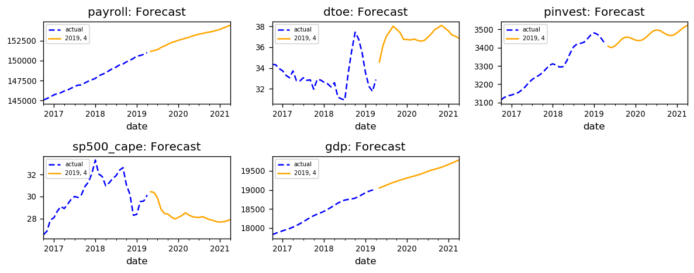

# Recession Forecaster

The United States as of November, 2019 has experienced the longest expansion cycle, yet the media is buzzing with talks of an impending recession next year. Recessions happen around every 8 to 10 years, so the question is not if, but when and how much. 

The first part is to predict impact on GDP using regression, because NBER defines a recession as ["a significant decline in economic activity"](https://www.nber.org/cycles.html), not 2 consecutive quarters of decline in real GDP. The second part (under construction) is to return a probabilistic model based on classification.

## How to View

Open [recession_forecaster.ipynb](https://github.com/whatguts/python-recession-forecaster/blob/master/recession_forecaster.ipynb)

## Installation

Create an environment using
`$ conda create --name <env> --requirements.txt`

## Progress

To view project progress, visit: trello.com/b/gLPiJZaJ/python-recession-forecaster

## Achknowledgements
Special thanks to Mortada Mehyar for creating [fredapi](https://github.com/mortada/fredapi)